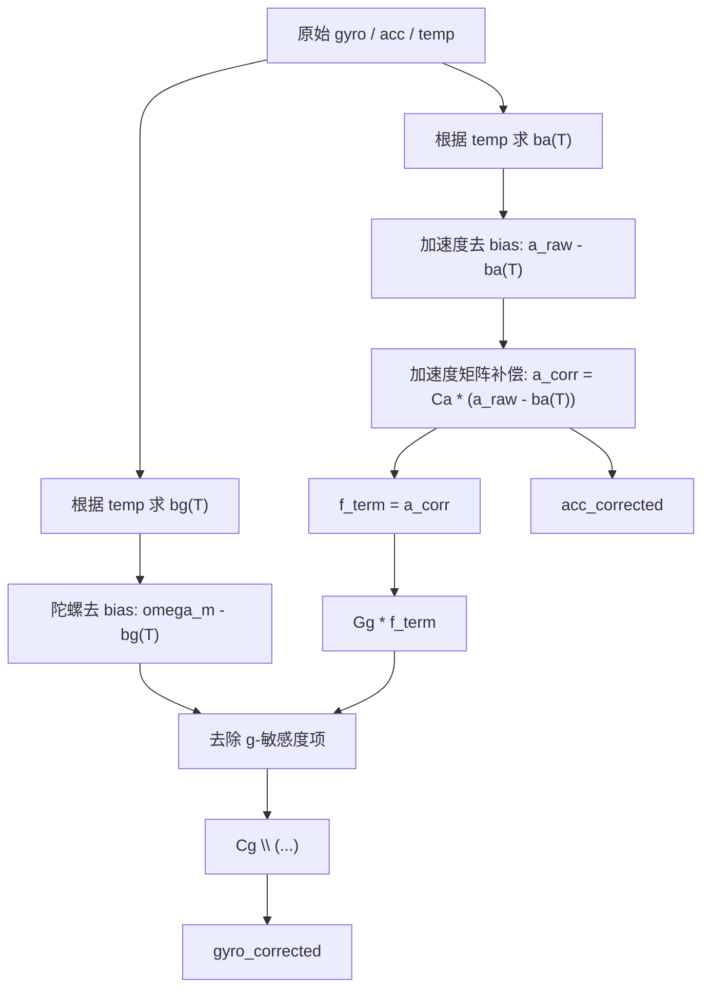

# 补偿算法与运行流程

统一运行期入口：

- `src/runtime/apply_imu_calibration.m`

## 1. 输入

原始数据：

- `raw.gyro`
- `raw.acc`
- 可选 `raw.temp`

标定参数：

- `bg`
- `ba`
- `Ca`
- `Cg`
- 可选 `Gg`
- 可选 `temp.bgModel / temp.baModel`

## 2. 完整补偿链路

## 3. 加速度

当前实际执行：

$$
a_{corr} = C_a (a_{raw} - b_a(T))
$$

若没有有效 `baModel`，则自动回退到常温固定 `ba`。

## 4. 陀螺

当前正向模型：

$$
\omega_m = C_g\omega_{ref} + b_g(T) + G_g f_{term} + n_g
$$

运行期逆补偿：

$$
\hat{\omega}_{ref} = \mathrm{solve}\left(C_g,\ \omega_m - b_g(T) - G_g f_{term}\right)
$$

## 5. 顺序

当前顺序与 Python 主线一致：

1. 根据温度求 `ba(T)`
2. 执行 `a_corr = Ca * (a_raw - ba(T))`
3. 根据温度求 `bg(T)`
4. 陀螺去 bias
5. 若 `Gg` 有效，则扣除 `Gg * f_term`
6. 执行 `Cg \ (...)`

其中 `f_term` 当前使用已补偿后的 `a_corr`。

## 6. 调试输出

`apply_imu_calibration(...)` 当前返回：

- `bgT`
- `baT`
- `bias_removed_gyro`
- `gsens_removed_gyro`
- `f_term`
- `g_term`

这些字段可直接用于和 Python 结果逐项对比。
