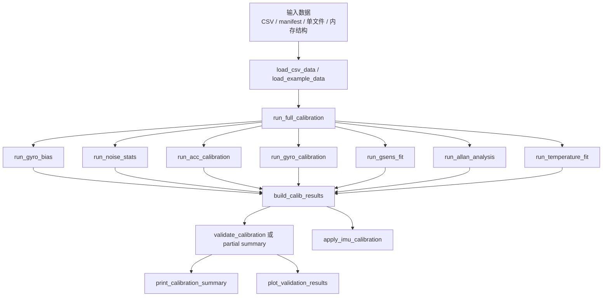

# 01 项目总览

## 1. 项目背景

本项目用于 6 轴 IMU 的离线标定、误差分析和运行时补偿。仓库内保留两套实现：

- `imu_calib_python/`：当前主线实现
- `imu_calib_matlab/`：MATLAB 参考实现

本次版本更新后，**Python 主线的加速度计标定方案已经切换为“静止多姿态 + 重力模长约束”**；MATLAB 侧暂未同步，仍保留旧参考向量方案。

## 2. 项目解决的问题

工程当前覆盖以下核心问题：

1. 陀螺静态零偏估计
2. 静态噪声统计
3. 加速度计静止多姿态标定
4. 陀螺总矩阵标定
5. `Kg / Mg` 拆分
6. `Gg` 残差法拟合
7. Allan deviation 分析
8. 温度相关 bias 分析
9. 运行时统一补偿

## 3. 核心处理链路

## 4. 数据类型

当前 Python 侧数据结构定义于：

- `imu_calib/models/data_structures.py`

主要数据块：

- `static`
- `acc_poses`
- `gyro_runs`
- `gsens_runs`

其中：

- `static` 可用于 bias、噪声、Allan、温度模型，也可尝试自动提取静止姿态均值
- `acc_poses` 是新加速度标定的标准输入

## 5. 标定与补偿在整体系统中的位置

### 5.1 离线标定层

输出参数包括：

- `bg`
- `Ca`
- `ba`
- `Sa / Ma`
- `Cg`
- `Kg / Mg`
- `Gg`
- `bg(T)`

### 5.2 运行补偿层

由 `imu_calib.runtime.apply_imu_calibration` 使用上述参数完成：

- 加速度补偿
- 陀螺 bias / 温度 / g-敏感度补偿
- 陀螺矩阵补偿

## 6. 当前加速度方案在整体链路中的位置

新加速度标定方法位于：

- `imu_calib.calib.fit_acc_multi_pose`
- `imu_calib.tasks.run_acc_calibration`

其输入不再依赖逐姿态参考重力方向，而是只要求多组静止姿态均值，并利用静止模长约束：

$$
\|a_{corr}\| = g
$$

## 7. MATLAB / Python 双实现关系

### 7.1 当前一致的部分

- 陀螺 `Cg` 仍使用稳态角度增量拟合
- `Kg / Mg` 拆分规则一致
- `Gg` 仍使用残差法
- CSV / manifest 基本结构一致

### 7.2 当前不一致的部分

- Python：加速度标定已改为静止多姿态重力模长约束
- MATLAB：仍保留旧的 `a_m = Ca * a_ref + ba` 参考向量方案

### 7.3 结论

若当前项目以 Python 为主线使用，应以 Python 文档和 Python 输出结果为准；若后续要同步 MATLAB，需要单独迁移其 `fit_acc_multi_pose.m`、loader、README 和测试。
