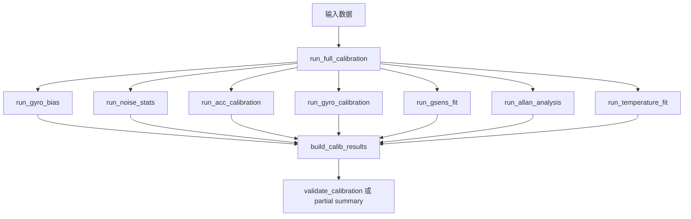

# 03 IMU 标定算法说明

## 1. 总体流程

当前完整标定由 `imu_calib/tasks/run_full_calibration.py` 组织：

工程支持：

- 完整流程
- 按模块独立运行
- partial 数据集

## 2. 各模块最小输入依赖

| 模块 | 任务入口 | 最小输入 |
| --- | --- | --- |
| 陀螺静态 bias | `run_gyro_bias` | `static.gyro` |
| 静态噪声 | `run_noise_stats` | `static.gyro`, `static.acc` |
| 加速度标定 | `run_acc_calibration` | `acc_poses` 或可提取静止段的 `static` |
| 陀螺 `Cg` 标定 | `run_gyro_calibration` | `gyro_runs + bg` |
| `Kg / Mg` 拆分 | `run_split_km` | `Cg` |
| `Gg` 拟合 | `run_gsens_fit` | `gsens_runs + bg + Cg` |
| Allan | `run_allan_analysis` | `static.t + (gyro/acc)` |
| 温度模型 | `run_temperature_fit` | `bg(T): static.gyro + static.temp`；`ba(T): static.acc + static.temp + 固定 Ca` |

## 3. 陀螺静态零偏估计

文件：

- `imu_calib/calib/estimate_gyro_bias.py`
- `imu_calib/tasks/run_gyro_bias.py`

模型：

$$
\omega_m \approx b_g + n_g
$$

对静态数据取均值：

$$
\hat{b}_g = \frac{1}{N} \sum_{k=1}^{N} \omega_m(k)
$$

输出：

- `bg`
- `std / var`
- `rms`
- 时间范围 / 温度范围统计

## 4. 静态噪声统计

文件：

- `imu_calib/calib/estimate_noise_stats.py`
- `imu_calib/tasks/run_noise_stats.py`

做法：

1. 对静态 `gyro` 和 `acc` 先去均值
2. 对残差计算 `std / var`
3. 保留 residual 供 Allan 扩展

## 5. 加速度计静止多姿态标定

文件：

- `imu_calib/calib/fit_acc_multi_pose.py`
- `imu_calib/calib/extract_static_pose_means.py`
- `imu_calib/tasks/run_acc_calibration.py`

当前主模型：

$$
a_{corr} = C_a(a_{raw} - b_a)
$$

静止约束：

$$
\|a_{corr}\| = g
$$

目标函数：

$$
\min_{\theta}\sum_i \left(\|C_a(a_{raw,i}-b_a)\| - g\right)^2
$$

当前默认参数化：

$$
C_a = S_a M_a
$$

说明：

- 不再依赖逐姿态参考方向
- `a_ref` 仅作为 legacy 初始化辅助
- 若输入为连续静止切换数据，会先自动提取静止段均值

## 6. 陀螺总矩阵 `Cg` 标定

文件：

- `imu_calib/calib/fit_gyro_C_from_angle_increment.py`
- `imu_calib/tasks/run_gyro_calibration.py`

当前核心约束不是瞬时角速度回归，而是稳态角增量拟合：

1. 每组 run 只取 `idx_ss == 1` 的稳态段
2. 先减去 `bg`
3. 对稳态段积分得到：

$$
d\theta_m = \int_{idx_{ss}}(\omega_m - b_g)\,dt
$$

4. 再拟合：

$$
d\theta_m = C_g d\theta_{ref}
$$

## 7. `Kg / Mg` 拆分

文件：

- `imu_calib/calib/split_km.py`

规则固定为：

$$
K_g = \mathrm{diag}(\mathrm{diag}(C_g)-1)
$$

$$
M_g = C_g - I - K_g
$$

这是解释性拆分，不是重新求解。

## 8. `Gg` 残差法拟合

文件：

- `imu_calib/calib/fit_gyro_g_sensitivity.py`
- `imu_calib/tasks/run_gsens_fit.py`

残差定义：

$$
r = \omega_m - b_g - C_g \omega_{ref}
$$

再拟合：

$$
r \approx G_g f_{term}
$$

当前实现使用联合 9 参数最小二乘。

## 9. Allan 分析

文件：

- `imu_calib/calib/analyze_allan_common.py`
- `imu_calib/calib/analyze_gyro_allan.py`
- `imu_calib/calib/analyze_acc_allan.py`
- `imu_calib/tasks/run_allan_analysis.py`

定位：

- 增强模块
- 不是主闭环标定的唯一依赖

## 10. 温度标定

文件：

- `imu_calib/calib/fit_temperature_bias_model.py`
- `imu_calib/runtime/get_gyro_bias_from_temperature.py`
- `imu_calib/runtime/get_accel_bias_from_temperature.py`
- `imu_calib/tasks/run_temperature_fit.py`

当前温度模块分两层：

### 第一层：离散温度点 bias 样本估计

陀螺：

$$
\hat{b}_g(T_j) = \mathrm{mean}(\omega_{static,bin_j})
$$

加速度：

$$
\hat{b}_a(T_j)=\arg\min_b \sum_i \left(\|C_a(a_{raw,i}-b)\|-g\right)^2
$$

这里 `Ca` 固定，不拟合 `Ca(T)`。

### 第二层：连续模型拟合

基于离散样本拟合：

- `bg(T)`
- `ba(T)`

支持模型：

- `poly1`
- `poly2`
- `poly3`
- `piecewise_linear`

多项式统一使用中心化温度变量：

$$
\Delta T = T - T_{ref}
$$

## 11. 标定后验证

文件：

- `imu_calib/validate/validate_calibration.py`
- `imu_calib/validate/plot_validation_results.py`

验证内容：

- 静态陀螺去 bias 后均值 / RMS
- 静态加速度模长校正前后对比
- 陀螺角增量误差前后对比
- `Gg` 残差前后对比
- Allan 状态
- 温度模型状态

在 partial 数据集下，会退化为 partial summary。

## 12. 待确认项

- MATLAB 工程当前尚未同步 `ba(T)` 与固定 `Ca` 的温度标定链路
- `Gg` 拟合端 `acc_ref` 与运行端 `f_term=a_corr` 的一致性需要结合真实采集链路确认
