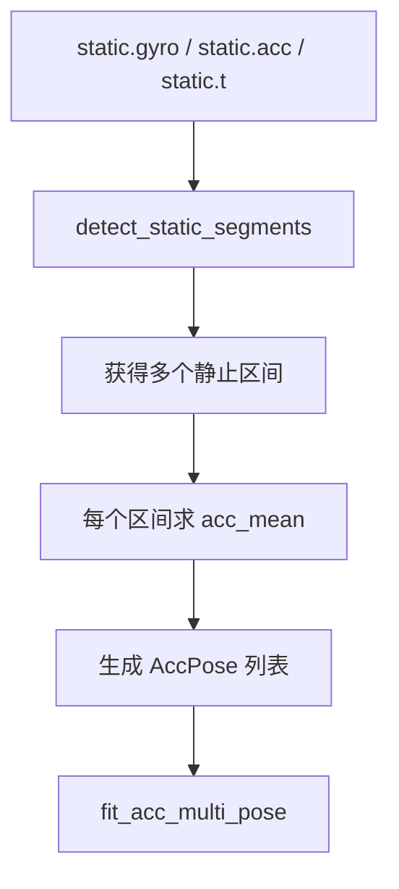

# 03 加速度计静止多姿态标定方案

## 1. 方法目标

当前 Python 主线中的加速度计标定，不再要求为每个姿态提供参考重力方向，而是仅使用多组静止姿态均值和重力模长约束完成参数求解。

核心文件：

- `imu_calib/calib/fit_acc_multi_pose.py`
- `imu_calib/calib/extract_static_pose_means.py`
- `imu_calib/tasks/run_acc_calibration.py`

## 2. 标定模型

对第 $i$ 组静止姿态样本，使用：

$$
a_{corr,i} = C(a_{raw,i} - b)
$$

静止约束为：

$$
\|a_{corr,i}\| = g
$$

因此目标函数为：

$$
\min_{\theta}\sum_i \left(\|C(a_{raw,i} - b)\| - g\right)^2
$$

## 3. 椭球到球面的几何解释

理想情况下，多个静止姿态的测量点应落在半径为 $g$ 的球面上。  
实际传感器存在 bias、比例因子和非正交误差时，点云会形成偏置椭球。标定的本质是找到一个平移 $b$ 和线性变换 $C$，把这组点尽量映射回球面。

## 4. 参数化方式

当前实际使用：

$$
C = S M
$$

其中：

$$
S = \mathrm{diag}(s_x, s_y, s_z)
$$

$$
M =
\begin{bmatrix}
1 & m_{xy} & m_{xz} \\
0 & 1 & m_{yz} \\
0 & 0 & 1
\end{bmatrix}
$$

这样做是为了避免仅靠模长约束时完全自由矩阵的不唯一性。

## 5. 初值策略

默认初值来自样本范围：

1. 用最大值与最小值的中点估计 $b$
2. 用半幅值估计三轴尺度
3. 将非正交项初值设为 0

若输入里仍带有 legacy `a_ref`，且 `use_legacy_reference_init = True`，则代码允许先用旧方案给一个初始化，再切回新目标函数做优化。

## 6. 优化器

当前使用：

- `scipy.optimize.least_squares`

主要配置位于：

- `imu_calib/runtime/default_calib_options.py`

相关参数：

- `gravity_magnitude`
- `parameterization`
- `optimizer_method`
- `optimizer_loss`
- `max_nfev`
- `ftol / xtol / gtol`

## 7. 静止段提取流程

若没有 `acc_poses`，但有 `static` 连续原始数据，则：

当前提取逻辑位于：

- `imu_calib/calib/extract_static_pose_means.py`

## 8. 输出结果

`run_acc_calibration(...)` 输出：

- `Ca`
- `ba`
- `Sa`
- `Ma`
- `gravity_magnitude`
- `fitInfo`

其中 `fitInfo` 包括：

- `method = static_multi_pose_gravity_constraint`
- `parameterization`
- `num_poses`
- `residual_rms`
- `raw_norm_mean/std`
- `corrected_norm_mean/std`
- `norm_error_mean/std/max_before`
- `norm_error_mean/std/max_after`
- `poseMetrics`
- `initialization`

## 9. 标定后验证

当前工程会输出以下验证指标：

- 静态模长校正前后均值与标准差
- 各姿态均值的模长误差前后对比
- `| ||a_{corr}|| - g |` 的 mean / std / max

## 10. 与旧方案的差异

旧方案：

- 必须提供 `ref_x/ref_y/ref_z`
- 本质是“已知方向的线性拟合”

新方案：

- 不需要参考方向
- 只依赖静止模长约束
- 更适合真实采集流程

## 11. 当前仓库状态

- Python：已完成迁移
- MATLAB：仍保留旧参考向量方案，待同步
